# Enterprise Active Directory Security Lab

## Overview

This project demonstrates the deployment and security hardening of a Windows-based Active Directory environment using Windows Server 2022 and Windows 10.

The lab simulates a small enterprise network with multiple departments, centralized authentication, Group Policy management, role-based access control (RBAC), endpoint security controls, file access management, and security auditing.

The objective of this project is to gain hands-on experience with Active Directory administration, Windows security, and enterprise access management practices commonly used in production environments.

---

## Project Architecture

```text
                    +----------------------+
                    |   Windows Server     |
                    |       DC01           |
                    |  Active Directory    |
                    |       DNS            |
                    +----------+-----------+
                               |
                               |
                     parthiv.local Domain
                               |
        ------------------------------------------------
        |              |              |               |
        |              |              |               |
       HR           Finance          IT            Sales
        |              |              |               |
      Users          Users          Users          Users
        |
    CLIENT01
```

---

## Lab Environment

| Component | Details |
|------------|----------|
| Hypervisor | Oracle VirtualBox |
| Domain Controller | Windows Server 2022 |
| Client Machine | Windows 10 |
| Domain Name | parthiv.local |
| Server Name | DC01 |
| Client Name | CLIENT01 |
| DNS Service | Active Directory Integrated DNS |

---

## Organizational Unit Structure

```text
parthiv.local
│
├── user
│   ├── HR
│   ├── Finance
│   ├── IT
│   └── Sales
│
├── Computer
│   ├── HR-pcs
│   ├── Finance-pcs
│   ├── IT-pcs
│   └── Sales-pcs
│
├── Groups
├── Admins
└── Service Accounts
```

---

## Security Groups

```text
GG_HR
GG_Finance
GG_IT
GG_Sales
```

These groups are used to implement Role-Based Access Control (RBAC) and folder permissions.

---

## User Management

Created and managed 20 domain users:

### Human Resources

```text
hr01
hr02
hr03
hr04
hr05
```

### Finance

```text
fin01
fin02
fin03
fin04
fin05
```

### Information Technology

```text
it01
it02
it03
it04
it05
```

### Sales

```text
sales01
sales02
sales03
sales04
sales05
```

---

# Security Controls Implemented

## Password Policy

Configured through Group Policy:

- Password Complexity Enabled
- Minimum Password Length: 12 Characters
- Password History Enabled
- Password Expiration Configured

---

## Account Lockout Policy

Configured to protect against brute-force attacks:

- Lockout Threshold: 5 Failed Attempts
- Lockout Duration: 15 Minutes
- Reset Counter After: 15 Minutes

---

## USB Device Restriction

Implemented Group Policy controls to prevent unauthorized removable storage usage.

### Result

- USB storage devices blocked
- Unauthorized data transfer prevented

---

## Software Restriction Policy

Implemented Software Restriction Policies (SRP) to block executable files from user download directories.

### Example

```text
C:\Users\*\Downloads\*.exe
```

### Result

Users cannot execute unauthorized applications downloaded from the internet.

---

## Windows Defender Firewall Management

Configured centralized firewall settings through Group Policy.

### Features

- Firewall Enabled
- Inbound Traffic Restricted
- Outbound Traffic Allowed
- Policy Managed Centrally

---

## Audit Logging & Monitoring

Enabled security auditing for:

### Successful Logons

```text
Event ID 4624
```

### Failed Logons

```text
Event ID 4625
```

### Benefits

- User activity tracking
- Security investigations
- Incident response support

---

## File Server & Access Control

Created department-based shared folders:

```text
HR
Finance
IT
Sales
```

Configured NTFS permissions using security groups.

### Example

| Security Group | Folder Access |
|----------------|--------------|
| GG_HR | HR Folder |
| GG_Finance | Finance Folder |
| GG_IT | IT Folder |
| GG_Sales | Sales Folder |

---

## Group Policy Objects (GPOs)

Implemented multiple security-focused Group Policies:

### HR_ControlPanel_Block

Prevented HR users from accessing Control Panel.

### HR_USB_Block

Blocked removable storage devices.

### HR_Software_Restriction

Restricted unauthorized software execution.

### Firewall_Policy

Centralized Windows Defender Firewall configuration.

---

## Validation & Testing

The following tests were successfully completed:

### Domain Join

- Windows 10 client successfully joined to domain

### User Authentication

- Domain users authenticated successfully

### GPO Verification

```powershell
gpresult /r
```

### Security Auditing

Verified Event IDs:

```text
4624 - Successful Logon
4625 - Failed Logon
```

### USB Restriction Testing

Verified blocked USB access.

### Software Restriction Testing

Verified executable blocking from Downloads folder.

### Firewall Verification

```cmd
netsh advfirewall show allprofiles
```

Verified firewall enabled on all profiles.

---

# Screenshots

## Active Directory Structure

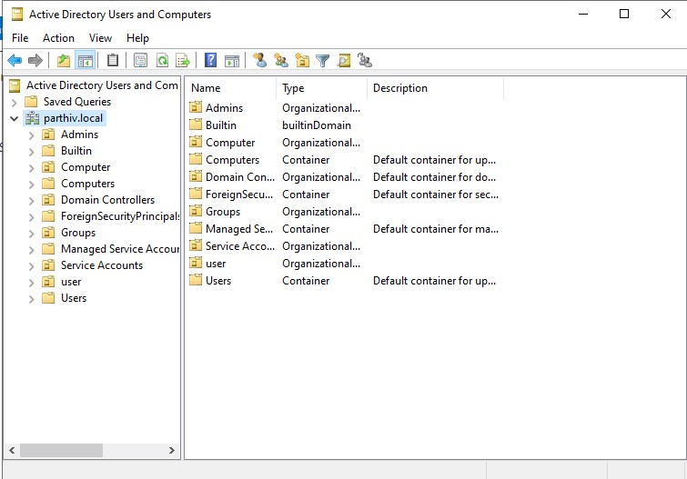

---


## Security Groups

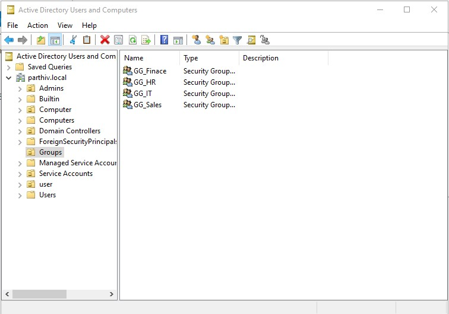

---

## Domain Users

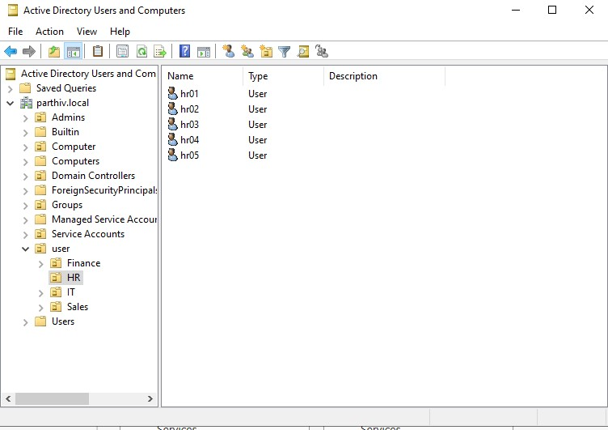

---

## Windows 10 Domain Join

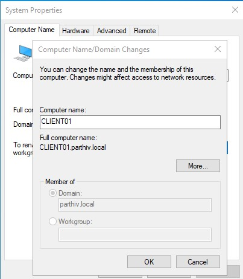

---

## Password Policy

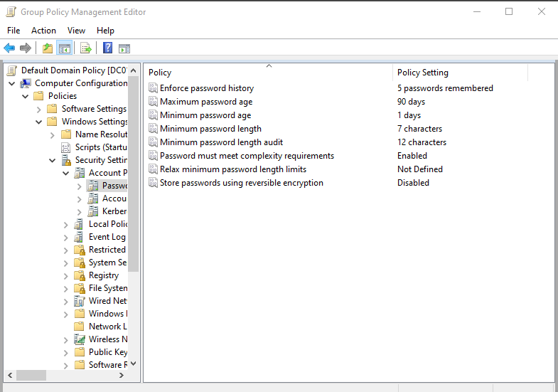

---

## Account Lockout Policy

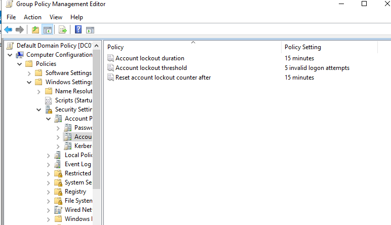

---

## Shared Folder Permissions

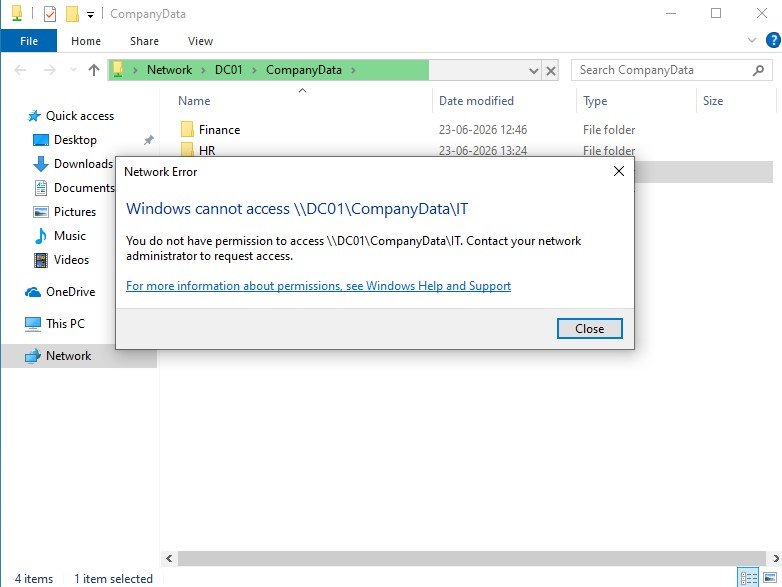

---

## USB Restriction Policy

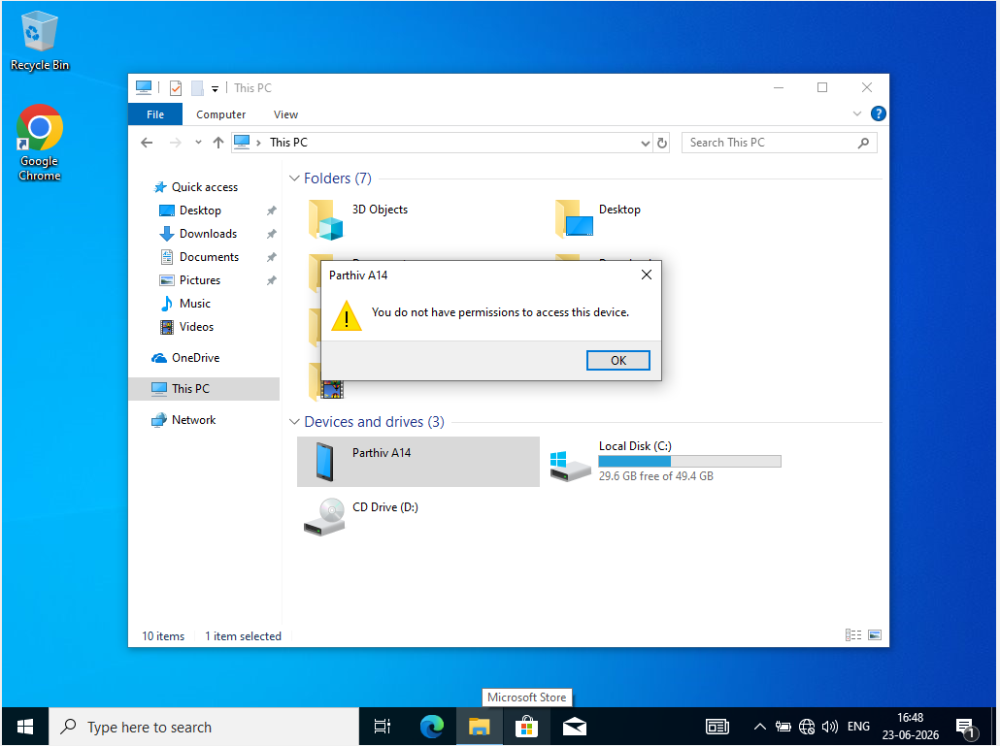

---

## Software Restriction Policy

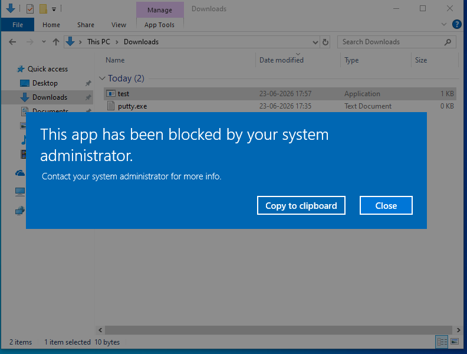

---

## Security Audit Logs

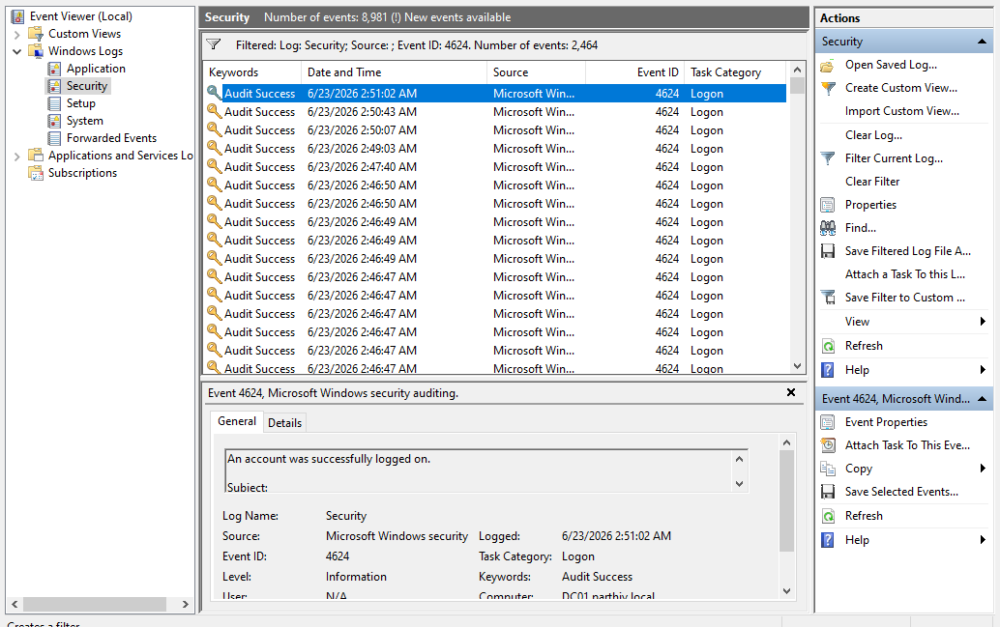

---

## Firewall Policy

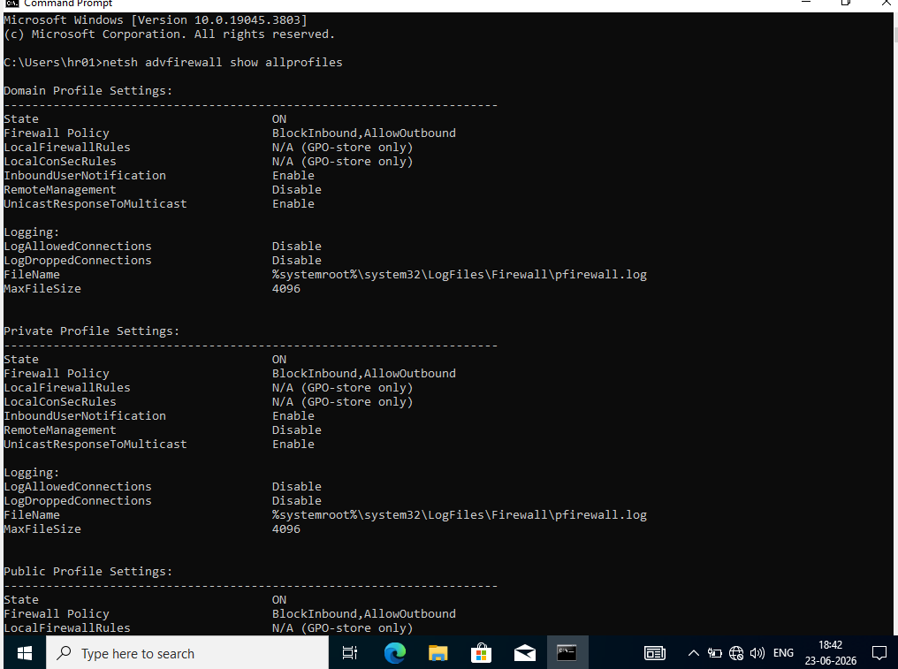

---

# Skills Demonstrated

- Active Directory Administration
- Windows Server Administration
- Group Policy Management
- Role-Based Access Control (RBAC)
- DNS Administration
- Windows Security Hardening
- Security Auditing
- Event Log Analysis
- Endpoint Security
- File Access Management
- Enterprise User Administration
- Cybersecurity Fundamentals

---

# Future Enhancements

Planned improvements:

- Wazuh SIEM Integration
- Sysmon Deployment
- Microsoft Defender Policy Management
- BitLocker Deployment
- LAPS (Local Administrator Password Solution)
- Security Monitoring Dashboard
- Incident Response Lab

---

## Author

**Parthiv Lalakiya**

B.Tech Information Technology

Aspiring SOC Analyst | Windows Security | Active Directory | Cybersecurity

LinkedIn:  https://www.linkedin.com/in/parthiv-lalakiya

 
